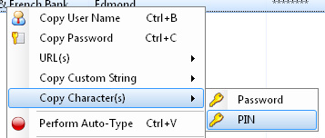

# Character-Copy

Character Copy is a lightweight [KeePass](http://keepass.info/) plugin that integrates into KeePass' entry menu and allows users to securely copy individual characters from an entry's protected string fields, such as the Password field.

The plugin provides the basic functionality provided by the [PICKCHARS placeholder](https://keepass.info/help/base/placeholders.html#pickchars), however it does so on all entries (without modifying the password database) and with a lightweight interface.

## Installation

[Download the latest release](https://github.com/SketchingDev/Character-Copy/releases)

1. Ensure you have KeePass version 2.x
2. Copy the DLL named 'CharacterCopy.dll' into the KeePass directory (where the KeePass.exe is) or a subdirectory of it.
3. Restart KeePass in order to load the new plugin.

## Usage
1. Right-click on an entry to bring up its context menu
   
2. Hover over the "Copy Character(s)" item to show the entry's protected fields
3. Click on the protected field you want to copy characters from
4. Use the window that appears to provide the position of the character you want to copy  
   
5. Click on the button to copy the character to the clipboard.
6. When you've finished copying characters just close the window.
